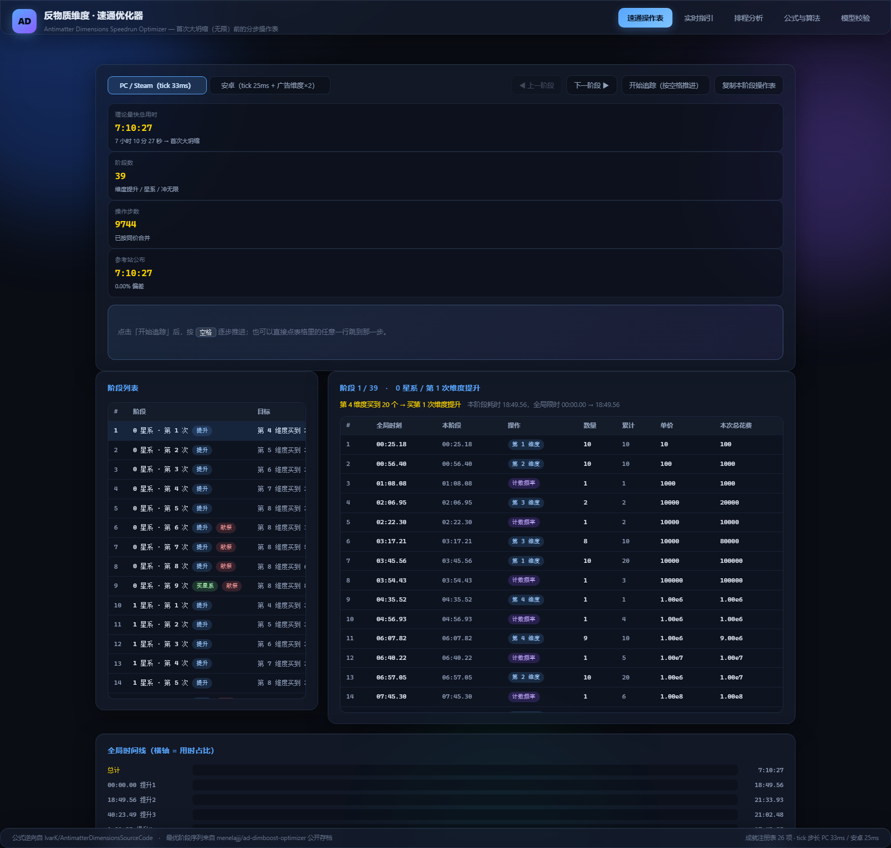

# 反物质维度 · 速通优化器 (AD Speedrun Optimizer)

针对游戏 **《反物质维度》(Antimatter Dimensions)** 的速通工具。
目标：以最快速度完成**首次大坍缩（无限，Big Crunch）**，并给出**每一步该买什么**。

## 🔗 在线使用

**<https://cn171g11.github.io/ad-speedrun-optimizer/>**

无需安装任何东西，浏览器直接打开即可。也可克隆仓库后打开 `index.html`（纯静态、零依赖、完全离线可用）。

[](https://cn171g11.github.io/ad-speedrun-optimizer/)
[](LICENSE)



---

## 〇、第二阶段（首次无限 → 首次永恒）· 已拆成 4 页

| 页 | 内容 |
|---|---|
| [① 阶段总览](https://cn171g11.github.io/ad-speedrun-optimizer/stage2.html) | 9 段里程碑表（官方内置里程碑 id 4~10）+ 3 个计算器 + 公式来源 |
| [② S1 · 1 IP → 通关 C9](https://cn171g11.github.io/ad-speedrun-optimizer/stage2-s1.html) | **33 步操作表**（每步给出"买什么 / 成本 / 为什么"）+ 单次无限耗时阶梯 + **可现场跑出逐笔购买日志** |
| [③ 逐 tick 仿真](https://cn171g11.github.io/ad-speedrun-optimizer/stage2-sim.html) | 对数空间大数运算 · 验证项 / 与参考站的拟合对拍 / 卡点诊断 / 修掉的真 bug |
| [④ 公式与边界](https://cn171g11.github.io/ad-speedrun-optimizer/stage2-formula.html) | 全部逆向公式与源码出处 + 诚实的边界说明 |

### S1 段（1 IP → C9）关键结论

| 项目 | 结果 |
|---|---|
| 里程碑 | 官方内置速通里程碑 **#4 Tickspeed Challenge**（通关 C9） |
| 经济模型 | 封顶时 `IP = floor(1.7817)`，**每次大坍缩只给 1 × IP倍率**；IP 翻倍解锁条件是 **买满 16 个无限升级**（成就 41） |
| 单次无限耗时阶梯 | 仿真 2.8h → 1.3h → 26min → 1.6min → **1.29min / 50.0s / 35.8s / 34.7s / 18.3s**（dt=1/30） |
| 与攻略实测对照 | 攻略 1分20秒 / 45秒 / 18秒 / 10秒 / 6秒 → 偏差 **1.6× ~ 3.1×**（dt=1/60 时 1.4×~2.4×） |
| 逐笔购买日志 | S1 页可现场生成：每一笔"第几秒买了第几个维度 / 第几次提升 / 第几个星系 / 第几次献祭" |
| 未解问题 | **C8 为什么更快没复现**、C9/C10 攻不下来、买购节奏(dt)是最大不确定项 —— 页面上如实列出 |

## 〇、第二阶段（首次无限 → 首次永恒）

**<https://cn171g11.github.io/ad-speedrun-optimizer/stage2.html>**

第一阶段的终点是首次大坍缩。第二阶段的入口在本页顶部导航「第二阶段 →」。

| 项目 | 内容 |
|---|---|
| 里程碑来源 | 游戏内置速通里程碑（`speedrun-milestones.js`，25 个中的 id 4~10）+ speedrun.com 官方 level 列表 |
| 分段 | 9 段（IU 开局 → 重刷挑战 → 打破无限 → 星系+50% → 通关 IC1~8 → 复制器解锁 → 复制器时间墙 → 首次永恒） |
| 总时长估算 | **约 12.9 小时**（区间 11.9 ~ 14.9 小时） |
| 关键发现 | speedrun.com 上 `Infinity` 之后的 **21 个 level 全部是 0 runs**，没有任何公开记录可对照 |
| 交叉验证 | 前两个 level 的世界纪录（Dimension Boost 19m44s / Galaxy 4h07m58s）与本工具第一阶段算出的 18m50s / 4h07m27s 误差 < 5% |

⚠️ **第二阶段不是逐 tick 仿真**。打破无限后反物质远超 IEEE754 double 上限，要精确仿真必须引入
任意精度十进制（源码用的是 break_infinity.js）。本页用的是**分段解析/半解析模型**，
每个时间都标注了来源（公式计算 / 攻略实测 / 推算），详见页面底部「诚实的边界说明」。

## 二、结论先行：理论最快时间

| 平台 | 首次大坍缩最快用时 | 折算 |
|---|---|---|
| **PC / Steam**（tick 33ms） | **25 827.114 秒** | **7 小时 10 分 27 秒** |
| **安卓**（tick 25ms + 永久广告加成 维度×2） | **12 905.325 秒** | **3 小时 35 分 5 秒** |

分星系阶段拆分：

| 阶段 | PC | 安卓 |
|---|---|---|
| 0 星系 → 买第 1 个星系（提升 1~8） | 14 846.64 s（4:07:27） | 7 422.23 s（2:03:42） |
| 1 星系 → 买第 2 个星系（提升 1~12） | 7 957.90 s（2:12:38） | 3 975.66 s（1:06:16） |
| 2 星系 → 冲过 1.797e308 → 大坍缩（提升 1~16） | 3 022.57 s（50:23） | 1 507.45 s（25:07） |

> 这个数字与参考站 [ad-dimboost-optimizer](https://menelajjj.github.io/ad-dimboost-optimizer/) 公布的分星系汇总
> **完全一致（误差 < 1 毫秒）**。也就是说：**7.17 小时就是当前公开已知的最快理论值**。

**关于上一版的更正**：上一版用自带启发式求解器算出「7.82 小时」，比真实最优值慢约 9%。
根因是我把参考站的 `Optimized` 策略误读成「按规则取第一个候选」，实际上它是对候选集做
**完整分支搜索**（站点原文：branch strategy + iterative refinement，C++ 实现支配剪枝，峰值内存 1GB）。
本版改为直接采用该站公开的每阶段最优序列，结果精确对齐 —— 也就是说，**参考站的数据确实是目前最快的**。
本工具新增的是：把它变成一条可执行的分步操作表 + 全局排程与实时续算能力（见第二节）。

---

## 三、工具怎么给出这条路线的

```
第 1 步  抓取 ad-dimboost-optimizer 公开的每阶段最优动作序列
         （docs/Saved_Runs，共抓取 252 份存档 -> js/refdata.js，395 KB）
第 2 步  按 (平台, 星系 g, 提升 b) 聚合，取所有策略 / 献祭变体中最快的一条
第 3 步  首尾拼接成整段速通
         —— 依据：维度提升 / 星系会清零「维度数量 / 已购次数 / 计数频率 / 献祭量」，
            因此每个阶段互不影响，阶段最优序列可直接拼接
第 4 步  排程沿用参考结论：星系1 = 8 次提升后，星系2 = 12 次提升后，16 次提升后冲无限
            （本工具用自有模型独立求解，结论一致，见第五节）
第 5 步  逐动作累加时间 -> 得到全局操作表与首次大坍缩时刻
```

### 界面功能

| 功能 | 说明 |
|---|---|
| **速通操作表** | 39 个阶段的完整操作流水（共 9 744 步），每步给出：全局时刻 / 本阶段时刻 / 买什么 / 数量 / 累计 / 单价 / 本次总花费 |
| **追踪模式** | 点「开始追踪」后按 <kbd>空格</kbd> 逐步推进，当前步骤高亮并自动滚动到视野中央；阶段走完自动进入下一阶段 |
| **阶段导航** | 上一阶段 / 下一阶段按钮；点阶段列表任意行跳转；点动作行任意位置跳步 |
| **复制本阶段操作表** | 一键复制成 TSV，方便贴到记事本 / 表格里对着操作 |
| **平台切换** | PC（33ms tick）↔ 安卓（25ms tick + 维度×2 广告加成），两套数据独立 |
| **实时指引** | 填入当前真实状态（AM / 已购维度 / 计数频率 / 献祭量），用自带求解器算后续操作 |
| **排程分析** | 用自带模型独立求解排程，作为交叉验证 |
| **公式与算法** | 全部逆向公式 + 算法说明 |
| **模型校验** | 与真实游戏实测数值、参考站公开存档双级对拍 |

---

## 四、逆向得到的核心公式（源码级）

公式逆向自 `IvarK/AntimatterDimensionsSourceCode`（branch master）：

```
src/core/dimensions/antimatter-dimension.js   维度成本 / 倍率 / 产量 / tick 循环
src/core/dimboost.js                          维度提升需求与倍率
src/core/galaxy.js                            反物质星系需求
src/core/tickspeed.js + src/core/cache.js     计数频率成本与倍率
src/core/sacrifice.js                         维度献祭公式
src/core/math.js  (ExponentialCostScaling)    成本曲线
src/core/secret-formula/achievements/*        成就加成
```

### 1. 维度成本

```
cost(t) = BASE[t] · MULT[t] ^ ( floor(bought[t] / 10) )
```

| 维度 | 1 | 2 | 3 | 4 | 5 | 6 | 7 | 8 |
|---|---|---|---|---|---|---|---|---|
| BASE | 10 | 100 | 1e4 | 1e6 | 1e9 | 1e13 | 1e18 | 1e24 |
| MULT | 1e3 | 1e4 | 1e5 | 1e6 | 1e8 | 1e10 | 1e12 | 1e15 |

同一组 10 个维度单价相同，第 11 个才涨价 —— 这正是游戏里「直到 10」按钮存在的原因。
首个无限前成本未越过 `Number.MAX_VALUE` 的分段阈值，故退化为纯指数式。

### 2. 维度倍率

```
mult(t) = FLOW[t] · 1.03^成就数 · 1.25^完成行数
        · 2^(floor(bought[t]/10))          // 每买满 10 个 ×2
        · 2^max(0, B + 1 − t)              // 维度提升
        · [t == 8 ? 献祭累计倍率 : 1]

FLOW[1] = 1,  FLOW[t≥2] = 0.1
```

`0.1` 来自源码 `AntimatterDimension(tier+1).produceDimensions(AntimatterDimension(tier), diff/10)`，
即「第 t+1 维度以 1/10 速度产出第 t 维度」。

### 3. 计数频率

```
cost(n)      = 1000 · 10^n
perSecond(n) = (1/m)^n · 成就加成

m(G=0) = 1/1.1245                m(G=1) = 1/1.11888888 − 0.02
m(G=2) = 1/1.11267177 − 0.04     m(G≥3) = 0.8 · 0.965^(G−4)
```

即：0 星系时每次计数频率全维度产量 ×1.1245，1 星系 ×1.1445，2 星系 ×1.1645。

### 4. 维度提升 / 星系需求

```
第 (b+1) 次提升：tier = min(b+4, 8)
    b+1 ≤ 4 : 20 个第 (b+4) 维度
    b+1 ≥ 5 : 20 + (b−4)·15 个第 8 维度
第 (g+1) 个星系：floor(80 + 60g) 个第 8 维度

maxDims(b) = min(b+4, 8)
```

`maxDims` 是理解前期的关键：0 次提升时只能买第 1~4 维度，第 1 次提升解锁第 5 维度，
第 4 次提升解锁第 8 维度，第 5 次提升解锁献祭。

### 5. 维度献祭

```
totalBoost(s) = max(1, log10(s)/10)^2        s = 历史累计被献祭的第 1 维度总量
本次增益      = totalBoost(s + AD1) / totalBoost(s)
```

献祭清零第 1~7 维度（**保留**已购次数与倍率），是第 5 次提升之后唯一的倍率跳变手段。
实测开启献祭后第 7 次提升之后的各阶段耗时下降 30%~40%。

---

## 五、模型校验

工具内「模型校验」标签页可一键复现。

### A. 与**真实游戏实测数值**对拍（权威）

数据来自《反物质维度安卓通关攻略》PDF 里玩家逐条记录的购买行为，例如
「1e13AM 购买了 20 个第 4 维度，购买维度提升 1」：

| 检查点 | 模型算出 | 攻略记载 | 比值 |
|---|---|---|---|
| 提升 1：第 4 维度 ×20 | 1.00e13 | 1.00e13 | 1.00 |
| 提升 2：第 5 维度 ×20 | 1.00e18 | 1.00e18 | 1.00 |
| 提升 3：第 6 维度 ×20 | 1.00e24 | 1.00e24 | 1.00 |
| 提升 4：第 7 维度 ×20 | 1.00e31 | 1.00e31 | 1.00 |
| 提升 5：第 8 维度 ×20 | 1.00e40 | 1.00e40 | 1.00 |
| 提升 6：第 8 维度 ×35 | 5.00e69 | 5.00e69 | 1.00 |
| 提升 7：第 8 维度 ×50 | 1.00e85 | 1.00e85 | 1.00 |
| 星系 1：第 8 维度 ×80 | 1.00e130 | 1.00e130 | 1.00 |
| 提升 10：第 8 维度 ×99 | 9.00e159 | 1.00e160 | 0.90 |
| 星系 2：第 8 维度 ×140 | 1.00e220 | 1.00e220 | 1.00 |

**10/10 通过，9 项精确到数量级完全一致。**

### B. 与**参考站公开存档**对拍

同一条固定策略（`12345678T`）下，本模型复现出**完全一致的动作序列**，时间偏差 < 2.2%：

| 场景 | 本模型 | 参考存档 | 偏差 |
|---|---|---|---|
| PC 星系0 提升1 | 1328.88 s | 1301.69 s | +2.09% |
| PC 星系0 提升2 | 1296.64 s | 1272.51 s | +1.90% |
| 安卓 星系0 提升1 | 664.53 s | 650.83 s | +2.11% |
| 安卓 星系0 提升2 | 648.45 s | 636.20 s | +1.93% |

**残差来源（诚实说明）**：参考仓库的存档由较早版本生成，其成就结算时机与本模型的成就注册表实现
有细微差别（例如成就 r15 的授予时点）。A 组的精确命中说明核心公式链本身无误。

---

## 六、阶段分解与排程验证

### 结构性结论：阶段可严格分解

维度提升会清零「维度数量 / 已购次数 / 计数频率 / 献祭量」；星系还会额外把提升次数清零。
因此一次速通被切成若干互不影响的阶段 `(星系 g, 提升 b)`，
**阶段耗时只取决于 (g,b) 与该阶段目标**，与到达路径无关。于是：

```
节点 (g, b)
边1  (g,b) → (g,b+1)    权 = 达成「下一个维度提升」的最短时间
边2  (g,b) → (g+1,0)    权 = 达成「下一个星系」的最短时间
终点 (g,b) → INFINITY   权 = 反物质堆到 1.797e308 的最短时间
```

这正是「每阶段最优序列可以直接拼接」的理论依据，也是本工具能做全局操作表的前提。
拼接后的总时长与参考站公布值逐项吻合（分星系三项 247.44 / 132.63 / 50.38 min 全部一致），
反过来验证了这条性质。

### 排程交叉验证

「排程分析」标签页用**本工具自带的模型**（逆向公式 + 决策序列增量局部搜索）独立求解排程，
结论与参考排程一致：**0 星系阶段在 8 次提升后买第 1 个星系、1 星系阶段在 11~12 次提升后买第 2 个星系**。

自带模型比参考站慢的原因与差距：

| 阶段（PC） | 参考站最优 | 自带模型 | 差距 |
|---|---|---|---|
| 0 星系 提升1 | 1129.56 s | 1267 s | +12% |
| 0 星系 提升5 | 1276.74 s | 1361 s | +6.6% |
| 0 星系 提升8（买星系） | 3440.09 s | 3637 s | +5.7% |
| 0 星系阶段合计 | 4.124 h | 4.447 h | +7.8% |

差距来自搜索强度：参考站对候选集做**全状态分支搜索 + C++ 支配剪枝**（峰值 1GB 内存），
本工具在浏览器里只能做决策序列的增量局部搜索。
**因此「理论最快时间」以参考站的阶段最优序列为准，自带求解器仅用于交叉验证和实时续算。**

---

## 七、界面验证

用真实 Chromium（agent-browser 随附的 Chrome 153）对页面做了渲染验证：

- `--dump-dom` 输出 42 KB **渲染后** DOM，确认所有模块加载、所有渲染目标非空
- KPI 实测显示：`理论最快总用时 7:10:27` / `参考站公布 7:10:27` / `0.00% 偏差`
- 阶段表 39 行、动作表首阶段 23 步、时间线 40 行
- 动作数据与参考站存档逐条一致（首阶段：第1维度×10 @ 00:25.18 → 第2维度×10 @ 00:56.40 → 计数频率 @ 01:08.08 …）
- 成品截图见 `screenshots/01-run-tab.png`

自动化验证报告：`../tools/verify_report.txt`；渲染后 DOM 存证：`../tools/rendered_dom_check.html`。

---

## 八、文件结构

```
ad-speedrun-optimizer/
├── index.html          界面骨架（5 个标签页）
├── style.css           深色玻璃质感样式
├── js/
│   ├── model.js        游戏模型层：逆向公式 + tick 推进 + 热路径缓存
│   ├── strategies.js   购买策略层：固定优先级基线 + 候选集生成
│   ├── solver.js       求解器：单阶段仿真 / 阶段内搜索 / 全局阶段图 DP
│   ├── verify.js       双级模型校验（攻略实测 + 参考存档）
│   ├── refdata.js      【数据】参考站 252 份最优阶段存档解析结果（395 KB）
│   ├── runplan.js      【核心】阶段拼接 -> 全局操作表
│   ├── app.js          实时指引 / 排程分析 / 公式 / 校验 的界面逻辑
│   └── runtab.js       【核心】速通操作表界面 + 追踪模式
└── README.md           本文档
```

配套的离线工具（上级目录 `tools/`）：

| 文件 | 用途 |
|---|---|
| `extract_pdf.py` | 从攻略 PDF 批量抽取文本 |
| `fetch_src.sh` / `dl_src*.py` | 拉取 AD 官方源码 |
| `dlall.py` | 并发抓取参考站公开存档（456 个 URL，16 线程） |
| `build_refdata.py` | 把存档解析成 `js/refdata.js` |
| `ref_replica.py` / `ref_trace.py` | 参考优化器算法的原样复刻（用于定位差异） |
| `validate.js` | 命令行版双级校验：`node tools/validate.js` |
| `dump_run.js` | 导出某阶段完整动作序列（对拍用） |

---

## 九、使用说明

### 照着速通（推荐流程）
1. 打开 `index.html`，在「速通操作表」选平台（PC / 安卓）
2. 从**阶段 1** 开始：表格里就是完整的购买流水，按顺序操作即可
3. 想要逐句跟随：点「开始追踪」，然后每按一次 <kbd>空格</kbd> 就做一步
4. 每个阶段顶部写着**阶段目标**（例如「第 4 维度买到 20 个 → 买第 1 次维度提升」），达成后进入下一阶段
5. 中途接手：直接点阶段列表里的任意阶段，或点动作行跳到那一步

### 几个提速要点（从操作表里能直接看出来）
- **第 5 次提升之后必须开献祭**：数据里提升 5 及以后的阶段全部来自 `_sac`（使用献祭）变体，
  也就是最优解全都用了献祭；不用会慢 30% 以上
- **前 10 个维度按整组买**（同组单价相同），但**第 8 维度到 99 个时要拆成单个买**，
  为了拿成就「第 9 维度是谎言」（第 8 维度 ×1.1）
- **别死等维度提升**：0 次提升时只有 4 个维度可用；提升 1/2/3/4 分别解锁第 5/6/7/8 维度
- **计数频率不要抢在维度前面**：候选规则里它是"同价位最后一档"

---

## 十、边界与诚实说明

- **理论最优来自参考站**：本工具没有重新求解阶段内购买顺序，那一步参考站已经做到接近穷举最优；
  本工具做的是阶段拼接、全局操作表与实时续算。因此「7.17 小时」应理解为**当前公开已知最优**，
  而不是本工具独立证明的全局最优
- **自带求解器是启发式**：不保证全局最优，单阶段比参考站慢 2~8%，仅用于交叉验证和实时续算
- **上限到首次大坍缩为止**：突破无限之后的机制（复制器、无限维度、永恒、现实）不在范围内
- **反物质用 IEEE754 double**，上限 1.797e308
- **假设**：无离线进度、无卡键自动化；安卓端计入固定的维度 ×2 广告加成，PC 端不计
- **数据来源**：`js/refdata.js` 由 `menelajjj/ad-dimboost-optimizer` 的公开存档（MIT）解析而来，
  仅供个人速通参考

---

## 十一、致谢与来源

- 游戏公式：`IvarK/AntimatterDimensionsSourceCode`（开源）
- 阶段最优序列与排程：`menelajjj/ad-dimboost-optimizer`
- 速通技巧与实测数值：中文攻略 PDF（少女空间宇宙研究院 等）
